# Balloon Pop Maths #
[Balloon Pop Maths Live Site](https://richardhenyash.github.io/balloon-pop-maths/)  

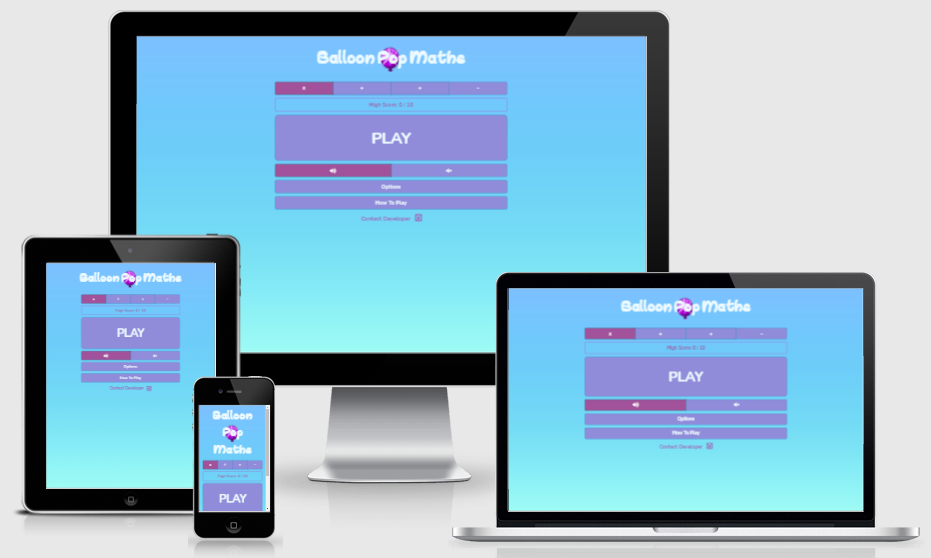

## Contents ##
- [Background](#background)
- [Project Goals](#project-goals)
- [Site Owner Goals](#site-owner-goals)
- [User Goals](#user-goals)
- [UX](#ux)
    - [Project Strategy](#project-strategy)
        - [Opportunities Matrix](#opportunities-matrix)
        - [Initial Development Phase](#initial-development-phase)
    - [Project Scope](#project-scope)
        - [User Demographics](#user-demographics)
        - [User Requirements](#user-requirements)
        - [User Stories](#user-stories)
        - [Contraints](#constraints)
        - [Functional Requirements](#functional-requirements)
        - [Business Rules](#business-rules)
        - [Key Features](#key-features)
    - [Site Map](#site-map)
    - [Wireframes](#wireframes)
    - [Design Choices](#design-choices)
        - [Fonts](#fonts)
        - [Colours](#colours)
- [Technologies](#technologies)
    - [Languages](#languages)
    - [Frameworks Libraries and Tools](#frameworks-libraries-and-tools)
    - [Browser Support](#browser-support)
- [Structure](#structure)
    - [Information Architecture](#information-architecture)
    - [Features Implemented](#features-implemented)
        - [Features Implemented in Phase 1](#features-implemented-in-phase-1)
        - [Features To Be Implemented In Future Development Phases](#features-to-be-implemented-in-future-development-phases)
        - [Design Changes During The Phase 1 Development](#design-changes-during-the-phase-1-development)
    - [Responsive Styling](#responsive-styling)
- [JavaScript Code Library](#javascript-code-library)
- [Game Logic](#game-logic)
- [Testing](#testing)
- [Deployment](#deployment)
- [Credits](#credits)
- [Acknowledgements](#acknowledgements)

## Background ##
During the Covid pandemic, many parents have been required to facilitate education for their children at home. Often, parents have found
themselves juggling full time jobs and home education responsibilities. School work, especially for younger children, requires a 
high degree of facilitation and help from busy parents. Interative web based maths games can give children an engaging way of 
learning new maths skills and reinforcing existing maths knowledge independently.

## Project Goals ##
To provide a simple and engaging maths game that young children are able to play independently to learn new maths skills and to
reinforce existing maths knowledge.

## Site Owner Goals ##
Developing the site will serve as a learning experience for the developer. The finished website will act as a showcase for the
developer's new skills and will also help to raise the developer's profile. The developer also hopes that his 7 year old
son will become a keen user of the site!

## User Goals ##
To play the maths game for fun, to learn new maths skills and to reinforce existing maths knowledge.

## UX ##

### Project Strategy ###

#### Opportunities Matrix ####
The following opportunities were identified and ranked using a score of 1 - 5 for importance and viability:

Opportunity | Importance |Viability
------------| -----------|---------
Balloon Pop Multiplication game|5|4
Balloon Pop Division game|3|4
Balloon Pop Addition game|3|4
Balloon Pop Subtraction game|3|4
Contact Form to contact developer|3|5
Link to developer [GitHub](https://github.com/richardhenyash) page|4|5
Subscribe Option|1|2

#### Initial Development Phase ####
The opportunities matrix was used to help decide which items should be included for the initial development phase (phase 1):
Item|Development Phase
----|-----------------
Balloon Pop Multiplication game|1
Contact Form to contact developer|1
Link to developer [GitHub](https://github.com/richardhenyash) page|1
Balloon Pop Division game|1
Balloon Pop Addition game|1
Balloon Pop Subtraction game|1
Subscribe Option|2

### Project Scope ###
#### User Demographics ####
* The primary users of the site will be Key Stage 1 and 2 school pupils from ages 5 to 10.
* A simple, bright, colorful and engaging design would fit this demographic.

#### User Requirements ####
* Visually engaging.
* Easy to navigate.
* Easy to update game settings.
* Responsive design is required as users may be viewing the site on Mobile, Tablet or Desktop.

#### User Stories ####
* ***As a user, I am playing the game for fun and enjoyment.***
* ***As a user, I am playing the game to learn new maths skills.***
* ***As a user, I am playing the game to reinforce existing maths knowledge.***
* ***As a user or parent, I would like to to provide feedback to the developer about the game.***

#### Constraints #####
* Developer skill set - the developer is currently learning JavaScript.
* Developer's available time - the developer is working full time whilst studying.
This coupled with the developer's current skills constraints may impact on whether
all four maths games can be incorporated into the site in the initial development phase.

#### Functional Requirements ####
* The user would like to be able to select different maths games to play.
* The user would like to be able to select different options within each maths game - e.g. 2x, 5x and 10x tables
within the multiplication game, or addition of numbers up to 20 in the addition game.
* The user would like to be able to set the difficulty level of the maths games -  this will give the games a wider age appeal.
* The user needs to be able to initiate the game from the menu, and return to the main menu if they want to abort the current game.
* The user would like to see their current score, and their previous top score. This will mean that the user is more likely to play
another game or return to the site in the future to better their previous score.
* The user would like to be able to contact the developer.

#### Business Rules ####
* It is not envisaged that the game will be sold for profit. However, the game should be as much fun as possible to play, in order to 
maximise the learning opportunities for users, increase the game's following and therefore increase the profile of the developer.

#### Key Features ####
The following key features have been identified and scored from 1 - 5 for importance and difficulty. The proposed development phase has also been indicated:
Feature|Importance|Difficulty|Development Phase
-------|----------|----------|-----------------
Balloon Pop Multiplication game| 5 | 3 | 1 |
Contact Form to contact developer | 4 | 2 | 1
Link to developer [GitHub](https://github.com/richardhenyash) page | 3 | 1 | 1
Balloon Pop Division game| 3 | 3 | 1
Balloon Pop Addition game| 3 | 3 | 1
Balloon Pop Subtraction game| 3 | 3 | 1
Subscribe Option| 1 | 3 | 2

### Site Map ###
An initial [Site Map](/assets/wireframes/site-map.png) was produced, and is shown below:  
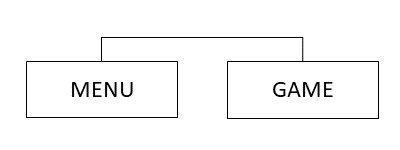

### Wireframes ###
[Hand Sketches](/assets/wireframes/rev0) were drafted showing the home page and times table game:  

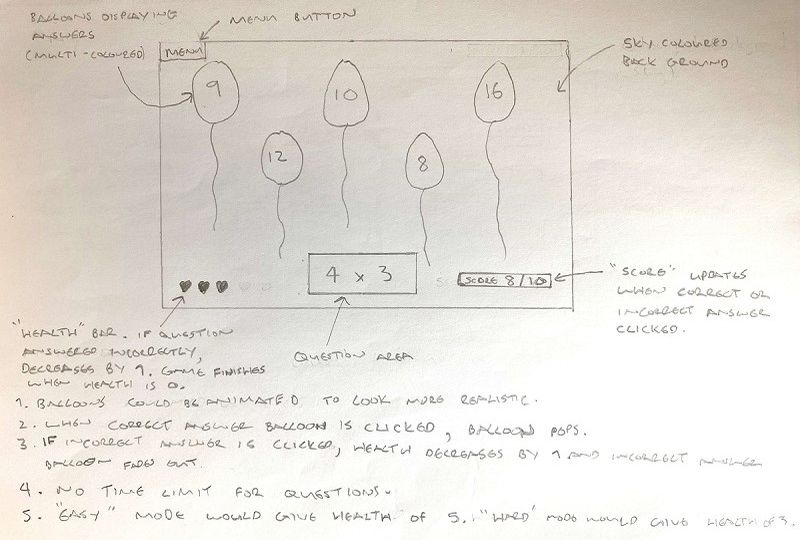

[Initial Wireframes](/assets/wireframes/rev1) were then produced showing the [Home](/assets/wireframes/rev1/home-multiplication.png)
page layout for each game mode: [Multiplication](/assets/wireframes/rev1/home-multiplication.png), 
[Division](/assets/wireframes/rev1/home-division.png), [Addition](/assets/wireframes/rev1/home-addition.png) 
and [Subtraction](/assets/wireframes/rev1/home-subtraction.png).  The  home page [Multiplication](/assets/wireframes/rev1/home-multiplication.png)
layout is also shown below:  

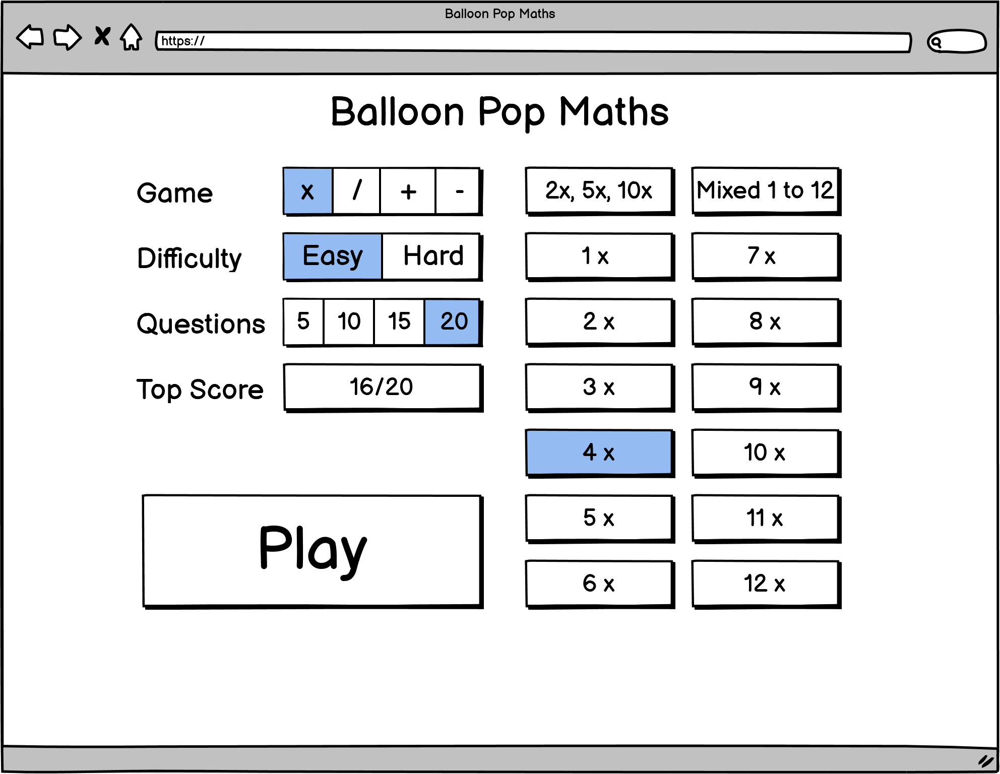 

[Initial Wireframes](/assets/wireframes/rev1) were also produced showing the [Game](/assets/wireframes/rev1/game-multiplication.png) 
page layout for each game mode: [Multiplication](/assets/wireframes/rev1/game-multiplication.png), 
[Division](/assets/wireframes/rev1/game-division.png), [Addition](/assets/wireframes/rev1/game-addition.png) 
and [Subtraction](/assets/wireframes/rev1/game-subtraction.png).  The game page [Multiplication](/assets/wireframes/rev1/game-multiplication.png)
layout is also shown below:  

 

[Responsive design wireframes](/assets/wireframes/rev2) were then produced showing the [Home](/assets/wireframes/rev1/home-multiplication.png)
and [Game](/assets/wireframes/rev1/game-multiplication.png) page layouts on [Tablet](/assets/wireframes/rev2/home-multiplication-tablet.png) and
[Phone](/assets/wireframes/rev2/home-multiplication-phone.png). The [Responsive design wireframes](/assets/wireframes/rev2) are also shown below:  

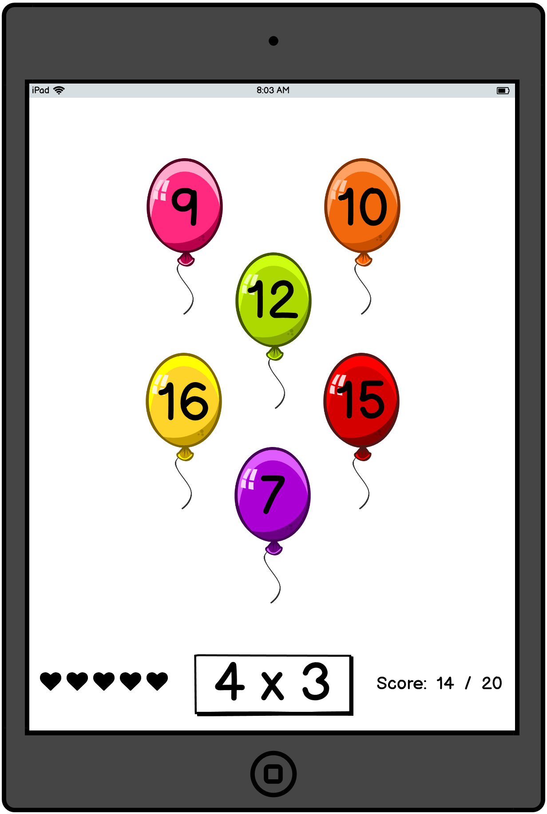
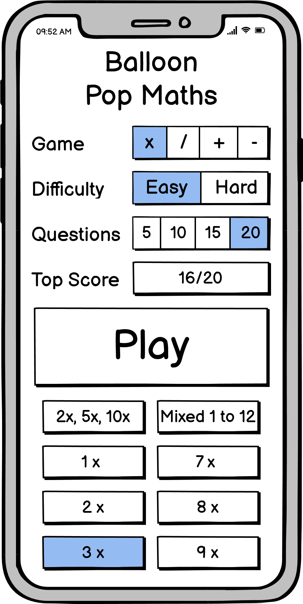
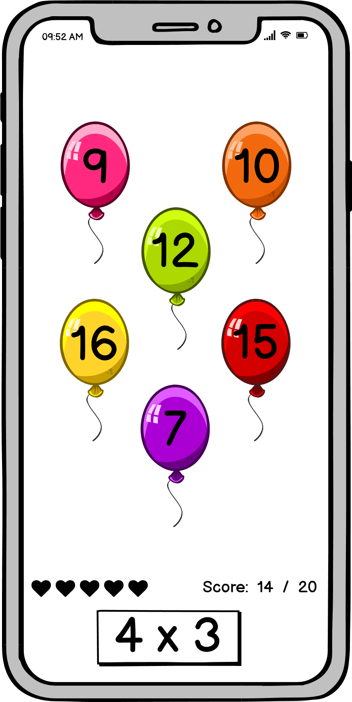  

### Design Choices ###

#### Fonts ####
[Whale I Tried](https://mistifonts.com/whale-i-tried/) has been chosen as the title font, and is used for the main **Balloon Pop Maths** [heading](./assets/testing/features/title.png). 
[Whale I Tried](https://mistifonts.com/whale-i-tried/) is a custom outlined cartoon font available from [Misti's Fonts](https://mistifonts.com/), 
and is free for personal and non-profit use. This font was chosen as it has a balloon like look and a soft, playful feel.
* font-family: "Whale I Tried", sans-serif;

[Nunito](https://fonts.google.com/specimen/Nunito?preview.text_type=custom) has been chosen as the main body font for text content. 
[Nunito](https://fonts.google.com/specimen/Nunito?preview.text_type=custom) is a clean, rounded and modern sans-serif font 
which works well with the maths game theme and complements the [Whale I Tried](https://mistifonts.com/whale-i-tried/) title font. 
[Nunito](https://fonts.google.com/specimen/Nunito?preview.text_type=custom) is available from [Google Fonts](https://fonts.google.com/) 
and is licensed under the [Open Font License](https://scripts.sil.org/cms/scripts/page.php?site_id=nrsi&id=OFL).
* font-family: 'Nunito', sans-serif;

#### Colours ####
The "sky" background colour is a 3 colour gradient generated using [ColorSpace](https://mycolor.space/gradient3). 
The three colours used (#7CC0FF, #6FD1F4, #9EFBF5) and the colour gradient generated are shown below:  

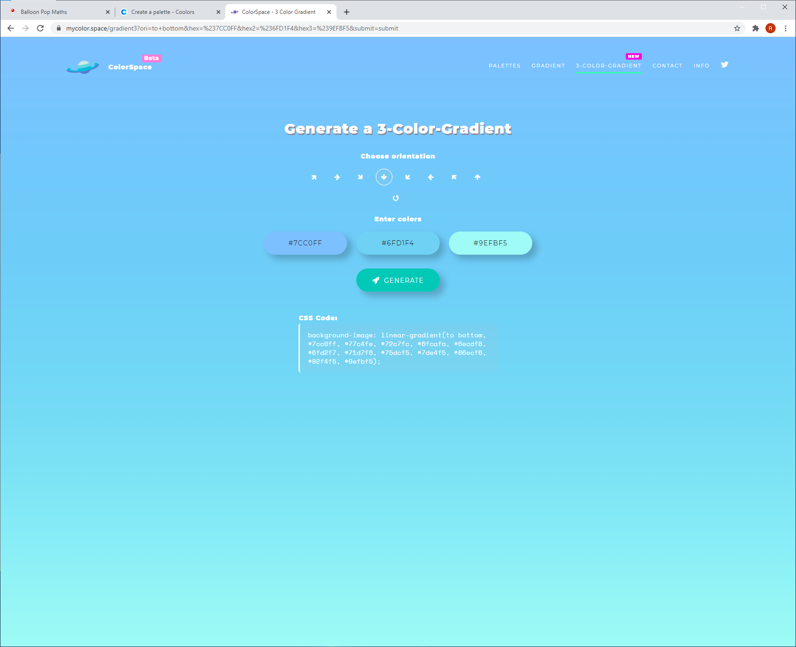 

The colour palette was chosen to tie-in with the first colour in the 3 colour gradient (#7CC0FF). 
Colour ideas were generated using the [ColorSpace](https://mycolor.space/) colour palette generator. 
The final colour palette selected is shown below:  

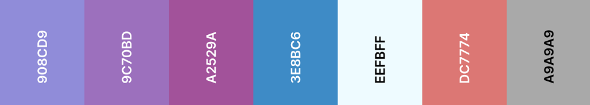  

* #908CD9 - "Blue Bell" - used for buttons, question area, score and high score outlines.
* #9C70BD - "Purple Mountain Majesty" - Used for button highlighting, footer and information area links and audio controls.
* #A2529A - "Purpureus" - Used for modal dialog text, high score text, score text, information text and highlighting.
* #3E8BC6 - "Green Blue Crayola" - Used for button and question area borders, 
* #EEFBFF - "Azure X 11 Web Color" - Used for title, button text, question text, balloon answer text and modal dialog background.
* #DC7774 - "Candy Pink" - Used for "Health" bar.
* #A9A9A9 - "Silver Chalice" - Used for text shadow on balloon answer text.

## Technologies ##
### Languages ###
* [HTML](https://developer.mozilla.org/en-US/docs/Web/HTML)
* [CSS](https://www.w3.org/Style/CSS/Overview.en.html)
* [JavaScript](https://developer.mozilla.org/en-US/docs/Web/JavaScript)

### Frameworks Libraries and Tools ###
* [Bootstrap](https://getbootstrap.com/docs/4.5/getting-started/introduction/)
* [jQuery](https://jquery.com/)
* [Font Awesome](https://fontawesome.com/)
* [Google Fonts](https://fonts.google.com/)
* [Email JS](https://www.emailjs.com/)
* [Jasmine](https://jasmine.github.io/)

### Browser Support ###
The following browsers are all supported by **Balloon Pop Maths**.
* [Google Chrome](https://www.google.com/intl/en_uk/chrome/)
* [Microsoft Edge](https://www.microsoft.com/en-us/edge)
* [Safari](https://www.apple.com/uk/safari/)
* [Firefox](https://www.mozilla.org/en-GB/firefox/new/)
* [Opera](https://www.opera.com/)

Please note that **Balloon Pop Maths** does not function correctly in 
[Microsoft Internet Explorer](https://support.microsoft.com/en-us/topic/internet-explorer-downloads-d49e1f0d-571c-9a7b-d97e-be248806ca70#ID0EBBD=Windows_10).
For further information please see  the **Browser Compatibility** section in [TESTING.md](TESTING.md).  

## Structure ##

### Information Architecture ###
The game is comprised of a single web page, [index.html](./index.html), divided into the following sections:
* The **Heading** section, containing the [**Balloon Pop Maths**](./assets/testing/features/title.png) title. 
* The **Options** section, containing the collapsing **[Game Options](./assets/testing/features/options.png)**.
* The **Information** section, containing the collapsing **[How To Play](./assets/testing/features/how-to-play.png)** information.
* The **Game** section, containing the [**In Game Elements**](./assets/testing/responsive/game-ipad.png). The **Heading**, **Options** and **Information** sections
are hidden when in **Game** mode. The **Game** section is hidden when not in **Game** mode.
* The **Footer** section, containing the **[Contact Developer](./assets/testing/features/contact-developer-link.png)** 
and **[GitHub](./assets/testing/features/github-link.png)** links. The footer is visible at all times.

### Features Implemented ###
#### Features Implemented in Phase 1 ####
* **Balloon Pop Maths** title, links to home page if selected:
 

* **Game Mode Selector** (including hover styling), facilitates switching between multiplication, division, subtraction and addition games:  
 

* **High Score Panel**, shows current high score. Updated if the user gets a new high score:
 

* **Play Button** (including hover styling), launches game:  
 

* **Options Audio Controls** (including hover styling), allows audio to be toggled on and off from the options area:  

* **Options Button** (including hover styling), opens collapsing options panel:  
 

* **How To Play Button** (including hover styling), opens collapsing information panel:  
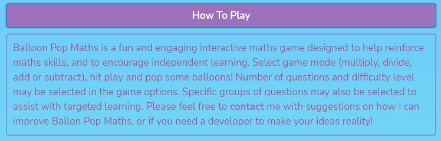 

* **Footer Contact Developer Link** (including hover styling), opens [Contact Modal](./assets/testing/features/contact-modal.png):  
 

* **Footer GitHub Link** (including hover styling), links to [Developer Page](https://github.com/richardhenyash) on [GitHub](https://github.com):  
 

* **In Game Home Button** (including hover styling), returns to **Home** panel from game:  

* **Game Loader**, displayed while game window is loading. Note that the **Game Loader** 
will only be visible the first time the game is played, depending 
on how quickly the game is initiated, as it is shown only until the [window load event](https://developer.mozilla.org/en-US/docs/Web/API/Window/load_event) is fired:  
  

* **In Game Score**, records current score in-game:  

* **Answer Balloons** showing potential answers. Balloons are animated using 
[JavaScript](https://developer.mozilla.org/en-US/docs/Web/JavaScript), showing a 
"pop" animation sequence and playing a "pop" sound if the correct answer is selected. 
If an incorrect answer is selected, a "deflate" sound is played and the balloon and
answer fades out:

* **Custom Cursor** - cursor is changed to a drawing pin when hovering over answer balloons:  

* **In Game Audio Controls**, allows audio to be toggled on and off in-game:  

* **Health Bar**, shows current health. Game finishes when health is fully depleted. 
If game is played on "Easy" difficulty level (selected in options), health is set to 5 hearts.
If game is played on "Medium" difficulty level (selected in options), health is set to 3 hearts.
If game is played on "Hard" difficulty level (selected in options), health is set to 1 heart:

* **Question Panel**, shows current question:

* **Contact Modal**, implemented using [Email JS](https://www.emailjs.com/) and [JavaScript Mail Library](./assets/js/mail.js). 
If the contact form is succesfully submitted, a [Success Modal](./assets/testing/features/contact-modal-success.png) is displayed. 
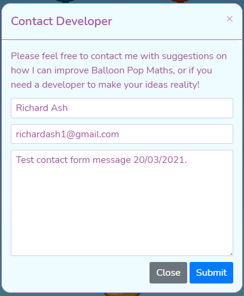
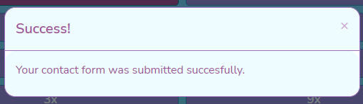

* **Game Feedback Modal**, gives varying feedback to the user at the end of a game:
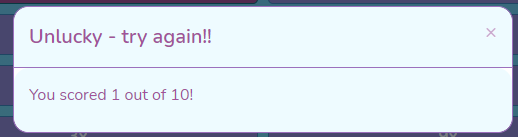

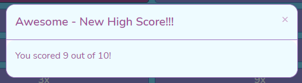

#### Features To Be Implemented In Future Development Phases ####
* Subscribe feature on [Contact Modal](./assets/testing/features/contact-modal.png) - this may be implemented in the future
if the developer decides to develop further similar games.

#### Design Changes During The Phase 1 Development ####
After initial early user testing and feedback, the following minor design changes were made:

* [In-game score](./assets/testing/features/game-score.png) was moved from underneath the game question to the top right corner.
* [Options audio controls](./assets/testing/features/options-audio.png) were added to allow audio to be toggled on and off from the options area.
* [In-game audio controls](./assets/testing/features/game-audio.png) were added to allow audio to be toggled on and off in-game.
* Collapsing [How To Play](./assets/testing/features/how-to-play.png) section was added underneath 
[Options](./assets/testing/features/options.png) to explain how to play and to give some further information about the game. 
* [Game loader](./assets/testing/features/game-loader.png) was added and is now shown until the game window is completeley loaded.
Note that the [game loader](./assets/testing/features/game-loader.png) will only be visible the first time the game is played, depending 
on how quickly the game is initiated, as it is shown only until the 
[window load event](https://developer.mozilla.org/en-US/docs/Web/API/Window/load_event) is fired. 
The event handler is located in the [JavaScript Event Handler Library](./assets/js/events.js).
* [In-game home button](./assets/testing/features/game-home.png) renamed from "Options" to "Home".

### Responsive Styling ###
* The [**Balloon Pop Maths**](./assets/testing/features/title.png) title is responsively styled, and stacks on screens under 768 pixels wide.
* The [**Balloon Pop Maths**](./assets/testing/features/title.png) title is re-sized and re-positioned for screen sizes under 680 pixels high.
* The [**Play Button**](./assets/testing/features/play.png) is responsively styled, and is re-sized for screen sizes under 680 pixels high.
* The [**Game**](./assets/testing/responsive/game-medium-screen.png) section is responsively styled, showing 2 
panels of 3 balloons stacked vertically on smaller devices, and side by side on large devices over 992 pixels wide.
* The [**Game**](./assets/testing/responsive/game-iphone11.png) section is dynamically sized for devices up to 992 pixels wide, 
so that it takes up the full screen height. A fixed size is implemented on large devices over 992 pixels wide.

See **Responsive Design** section in [TESTING.md](TESTING.md) for further information and [Responsive Testing](./assets/testing/responsive) screen prints.

## JavaScript Code Library ##
The [JavaScript](https://developer.mozilla.org/en-US/docs/Web/JavaScript) code has been broken down into seperate, re-usable 
functions where possible and is contained within several [JavaScript Code Library](./assets/js) files:
* [JavaScript Animation Function Library](./assets/js/events.js)
* [JavaScript Audio Function Library](./assets/js/audio.js)
* [JavaScript Display Interaction Function Library](./assets/js/display.js)
* [JavaScript Event Handler Library](./assets/js/events.js)
* [JavaScript Game Logic Function Library](./assets/js/game-logic.js)
* [JavaScript Initialisation Library](./assets/js/initialisation.js)
* [JavaScript Mail Library](./assets/js/mail.js)
* [JavaScript Maths Function Library](./assets/js/maths.js)  

Each function is fully documented using [JSDoc](https://jsdoc.app/about-getting-started.html) comments.

## Game Logic ##
The game logic was developed using [JavaScript](https://developer.mozilla.org/en-US/docs/Web/JavaScript).  

When the user hits the [Play](./assets/testing/features/play.png) button, the heading, options and information
sections of the [index](index.html) page are hidden and the game section is shown. 
The selected options are gathered using functions in the [JavaScript Display Interaction Functions Library](./assets/js/display.js) 
and are stored in global variables. All global variables are initialised in the 
[JavaScript Initialisation Library](./assets/js/initialisation.js) and are prefixed with "bpm".  

The user is presented with a [maths question](./assets/testing/features/game-question.png). The question type depends on the selected 
[Game Mode](./assets/testing/features/game-mode.png). 
6 potential answers are presented in the [answer balloons](./assets/js/game-balloons.js), 1 correct answer and 5 wrong answers. 
Random maths questions and correct and incorrect answers are generated using functions in the 
[JavaScript Maths Function Library](./assets/js/maths.js).

If the game is played on "Easy" difficulty level (selected in options), [health](./assets/testing/features/game-health.png) is set to 5 hearts.
If the game is played on "Medium" difficulty level (selected in options), [health](./assets/testing/features/game-health.png) is set to 3 hearts.
If the game is played on "Hard" difficulty level (selected in options), [health](./assets/testing/features/game-health.png) is set to 1 heart.  

If the user selects the correct answer, the balloon "popping" animation and sound is played using functions in the 
[JavaScript Animation Function Library](./assets/js/animation.js), and the score increments by 1. 
If the user selects the wrong answer, the "deflate" sound is played, the selected balloon and answer text fades out and 
[health](./assets/testing/features/game-health.png) is depleted by 1 heart. The game continues until the user has either answered 
all of the questions or their [health](./assets/testing/features/game-health.png) has been fully depleted.  

When the game is complete, the user is presented with a [Feedback Modal](./assets/testing/features/modal-well-done.png). The feedback message 
varies depending on how well the user has played the game. If the user has scored less than 4, the [Unlucky](./assets/testing/features/modal-unlucky.png)
modal is shown. If the user has scored 4 or more but has not achieved a new high score, the [Well Done](./assets/testing/features/modal-well-done.png) modal is shown.
If the user has achieved a new high score, the [High Score](./assets/testing/features/modal-high-score.png) modal is shown, and the 
[High Score](./assets/testing/features/high-score.png) panel on the [index](index.html) page is updated.

See [Game Logic UML Diagram](./assets/wireframes/game-logic.png) for a visual representation of the **Game Logic**:  

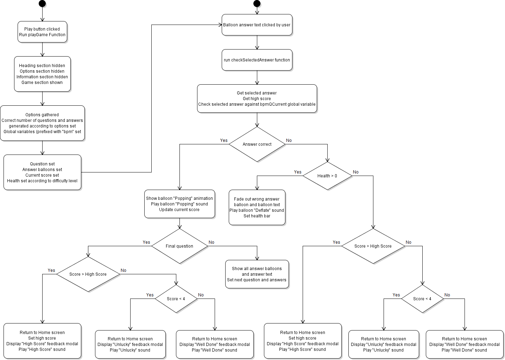 

## Testing ##

Further testing information and screen prints can be found in [TESTING.md](TESTING.md).

## Deployment ##
The project has been developed using [Gitpod](https://www.Gitpod.io/) and [GitHub](https://github.com/). 
The project was regularly commited to [GitHub](https://github.com/) during the initial development phase.
The website resides as a repository in [GitHub](https://github.com/) and has been been deployed 
using [GitHub Pages](https://richardhenyash.github.io/balloon-pop-maths/). 

The steps required to deploy the website to [GitHub Pages](https://pages.github.com/) are as follows:
* Go to the [Project Code Repository Location](https://github.com/richardhenyash/balloon-pop-maths) on [GitHub](https://github.com/).
* Select "Settings" (the gear icon) in the top right corner.
* Scroll Down to the [GitHub Pages](https://pages.github.com/) section.
* Set the desired source branch. For [Balloon Pop Maths](https://richardhenyash.github.io/balloon-pop-maths/), 
the deployed source branch is the 
[Master](https://github.com/richardhenyash/balloon-pop-maths/tree/master) branch.
* Click the "Save" button. A tick should now be shown above the "Source" panel in a 
green panel which also contains the published site address. 
For [Balloon Pop Maths](https://richardhenyash.github.io/balloon-pop-maths/) 
this is https://richardhenyash.github.io/balloon-pop-maths/.
* For further help and information, see the following links:
[About GitHub Pages](https://docs.github.com/en/github/working-with-github-pages/about-github-pages#publishing-sources-for-github-pages-sites), and  
[Creating A GitHub Pages Site](https://docs.github.com/en/github/working-with-github-pages/creating-a-github-pages-site).

In order to make a fork or clone of the project, a [GitHub](https://www.Gitpod.io/) account is required. 
The [Gitpod Browser Extension](https://www.Gitpod.io/docs/browser-extension/) is also recommended.  

The project may be forked by following these steps:
* Go to the [Project Code Repository Location](https://github.com/richardhenyash/balloon-pop-maths) on [GitHub](https://github.com/).
* In the top-right corner of the page, click "Fork".  

For further information on forking a [GitHub](https://github.com/) repository, 
see the [GitHub Documentation](https://docs.github.com/en/github/getting-started-with-github/fork-a-repo).

The project may be cloned by following these steps:
* Go to the [Project Code Repository Location](https://github.com/richardhenyash/balloon-pop-maths) on [GitHub](https://github.com/).
* Select the "Code" dropdown and choose "GitHub CLI" under "Clone". This will give you a URL that may be copied into the clipboard. 
* Open the Git Bash command line interface in [Gitpod](https://www.Gitpod.io/).
* Change the current working directory to the location where you would like the cloned directory to reside.
* Type git clone, and then paste the URL copied earlier, eg:  
$ git clone https://github.com/richardhenyash/balloon-pop-maths
* Press Enter to create the local clone.

The code may also be downloaded to a local computer by following these steps:
* Go to the [Project Code Repository Location](https://github.com/richardhenyash/balloon-pop-maths) on [GitHub](https://github.com/).
* Select the "Code" dropdown and choose the "Download ZIP" option.
* This will download a copy of the entire project locally as a .zip file.  

For further information on cloning a [GitHub](https://github.com/) repository, see the [GitHub Documentation](https://docs.github.com/en/github/creating-cloning-and-archiving-repositories/cloning-a-repository).

## Credits ##

Many thanks to the following:
* [favicon.cc](https://www.favicon.cc/) for the [Balloon Favicon](https://www.favicon.cc/?action=icon&file_id=706495).
* [Game Developer Studio](http://www.gamedeveloperstudio.com/) for the awesome [balloon Sprite Images](https://www.gamedeveloperstudio.com/graphics/viewgraphic.php?item=134l668d3b3n083827).
* [SVG repo](https://www.svgrepo.com/) for the [Pin SVG Image](https://www.svgrepo.com/svg/207632/push-pin).
* [mixkit](https://mixkit.co/) for the brilliant [Sound Effects](https://mixkit.co/free-sound-effects/game/).
* [Martin Himmel](https://dev.to/martyhimmel/animating-sprite-sheets-with-javascript-ag3) 
and [Spicy Yoghurt](https://spicyyoghurt.com/tutorials/html5-javascript-game-development/images-and-sprite-animations) 
for additional help on sprite animations.  
* [loading.io](https://loading.io/css/) for the attractive [Game loader](./assets/testing/features/game-loader.png).
* [Laurens Holst](https://stackoverflow.com/questions/2450954/how-to-randomize-shuffle-a-javascript-array) for the
 JavaScript [shuffleArray function](./assets/js/maths.js) to randomize an array in place using the Durstenfeld shuffle algorithm.
* [MDN Web Docs](https://developer.mozilla.org/en-US/docs/Web/JavaScript/Reference/Global_Objects/Math/random) 
for the JavaScript [getRandomIntInclusive function](./assets/js/maths.js) to 
return a random integer between the two integers given.

## Acknowledgements ##

Many thanks to the following for help and inspiration during this project:
* [Neringa Bickmore](https://github.com/neringabickmore) for your valued early review and comments on the game and documentation.
* My mentor [Reuben Ferrante](https://github.com/arex18) for helping to get me started off on the right footing and for the insightful
review and comments on the game.
* [Ben Kavanagh](https://github.com/BAK2K3) for the [Game loader](./assets/testing/features/game-loader.png) inspiration and helpful comments 
on the game and testing process.
* The [Code Institute](https://codeinstitute.net/) [slack](https://slack.com/intl/en-gb/) community, for all your encouragement and positive feedback.
