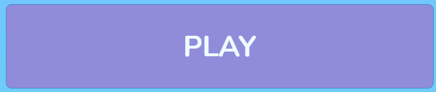
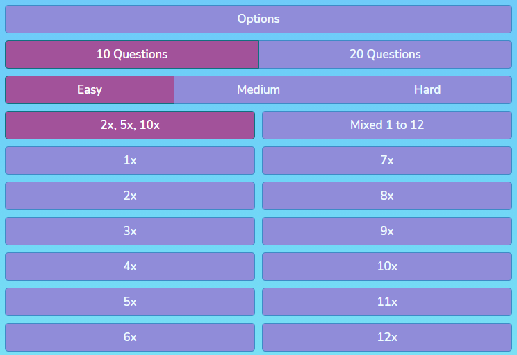
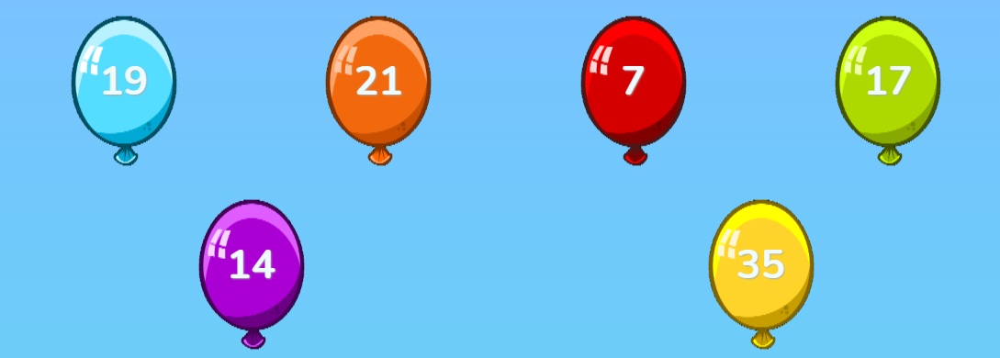
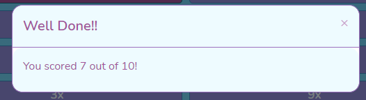

# Balloon Pop Maths #

## Contents ##
- [Background](#background)
- [Site Owner Goals](#site-owner-goals)
- [Project Goals](#project-goals)
- [User Goals](#user-goals)
- [UX](#ux)
    - [Project Strategy](#project-strategy)
        - [Opportunities Matrix](#opportunities-matrix)
        - [Initial Development Phase](#initial-development-phase)
    - [Project Scope](#project-scope)
        - [User Demographics](#user-demographics)
        - [User Requirements](#user-requirements)
        - [User Stories](#user-stories)
        - [Contraints](#constraints)
        - [Functional Requirements](#functional-requirements)
        - [Business Rules](#business-rules)
        - [Features](#features)
    - [Site Map](#site-map)
    - [Wireframes](#wireframes)
    - [Design Choices](#design-choices)
        - [Fonts](#fonts)
        - [Colours](#colours)
- [Technologies](#technologies)
    - [Languages](#languages)
    - [Frameworks Libraries and Tools](#frameworks-libraries-and-tools)
- [Features](#features)
    - [Features Implemented in Phase 1](#features-implemented-in-phase-1)
    - [Features To Be Implemented In Future Development Phases](#features-to-be-implemented-in-future-development-phases)
    - [Design Changes During The Phase 1 Development](#design-changes-during-the-phase-1-development)
- [Game Logic](#game-logic)
- [Testing](#testing)
- [Deployment](#deployment)
- [Credits](#credits)
- [Acknowledgements](#acknowledgements)

## Background ##
During the Covid pandemic, many parents have been required to facilitate education for their children at home. Often, parents have found
themselves juggling full time jobs and home education responsibilities. School work, especially for younger children, requires a 
high degree of facilitation and help from busy parents. Interative web based maths games can give children an engaging way of 
learning new maths skills and reinforcing existing maths knowledge independently.

## Site Owner Goals ##
Developing the site will serve as a learning experience for the developer. The finished website will act as a showcase for the
developer's new skills and will also help to raise the developer's profile. The devloper also hopes that his 7 year old
son will become a keen user of the site!

## Project Goals ##
To provide a simple and engaging maths game that young children are able to play independently to learn new maths skills and to
reinforce existing maths knowledge.

## User Goals ##
To play the maths game for fun, to learn new maths skills and to reinforce existing maths knowledge.

## UX ##

### Project Strategy ###

#### Opportunities Matrix ####
The following opportunities were identified and ranked using a score of 1 - 5 for importance and viability:

Opportunity | Importance |Viability
------------| -----------|---------
Balloon Pop Multiplication game|5|4
Balloon Pop Division game|3|4
Balloon Pop Addition game|3|4
Balloon Pop Subtraction game|3|4
Contact Form to contact developer|3|5
Link to developer [GitHub] page (https://github.com/richardhenyash)|4|5
Subscribe Option|1|2

#### Initial Development Phase ####
The opportunities matrix was used to help decide which items should be included for the initial development phase (phase 1):
Item|Development Phase
----|-----------------
Balloon Pop Multiplication game|1
Contact Form to contact developer|1
Link to developer [GitHub] page (https://github.com/richardhenyash)|1
Balloon Pop Division game|1
Balloon Pop Addition game|1
Balloon Pop Subtraction game|1
Subscribe Option|2

### Project Scope ###
#### User Demographics ####
* The primary users of the site will be Key Stage 1 and 2 school pupils from ages 5 to 10.
* A simple, bright, colorful and engaging design would fit this demographic.

#### User Requirements ####
* Visually engaging
* Easy to navigate
* Easy to update game settings
* Responsive design is required as users may be viewing the site on Mobile, Tablet or Desktop.

#### User Stories ####
* ***As a user, I am playing the game for fun and enjoyment.***
* ***As a user, I am playing the game to learn new maths skills.***
* ***As a user, I am playing the game to reinforce existing maths knowledge.***
* ***As a user or parent, I would like to to provide feedback to the developer about the game.***

#### Constraints #####
* Developer skill set - the developer is currently learning JavaScript. This may impact on whether all four maths games
can be incorporated into the site in the initial development phase.

#### Functional Requirements ####
* The User would like to be able to select different maths games to play.
* The user would like to be able to select different options within each maths game - e.g. 2x, 5x and 10x tables
within the multiplication game, or addition of numbers up to 20 in the addition game.
* The user would like to be able to set the difficulty level of the maths games -  this will give the games a wider age appeal.
* The user needs to be able to initiate the game from the menu, and return to the main menu if they want to abort the current game.
* The user would like to see their current score, and their previous top score. This will mean that the user is more likely to play
another game or return to the site in the future to better their previous score.
* The user would like to be able to contact the developer.

#### Business Rules ####
* It is not envisaged that the game will be sold for profit. However, the game should be as much fun as possible to play, in order to 
maximise the learning opportunities for users, increase the game's following and therefore increase the profile of the developer.

#### Features ####
The following key features have been identified and scored from 1 - 5 for importance and difficulty. The proposed development phase has also been indicated:
Feature|Importance|Difficulty|Development Phase
-------|----------|----------|-----------------
Balloon Pop Multiplication game| 5 | 3 | 1 |
Contact Form to contact developer | 4 | 2 | 1
Link to developer [GitHub] page (https://github.com/richardhenyash) | 3 | 1 | 1
Balloon Pop Division game| 3 | 3 | 1
Balloon Pop Addition game| 3 | 3 | 1
Balloon Pop Subtraction game| 3 | 3 | 1
Subscribe Option| 1 | 3 | 2

### Site Map ###
An initial [Site Map](/assets/wireframes/site-map.png) was produced, and is shown below:  

### Wireframes ###
[Hand Sketches](/assets/wireframes/rev0) were initially produced showing the home page and times table game:  

[Initial Wireframes](/assets/wireframes/rev1) were produced showing the [Home]("/assets/wireframes/rev1/home-multiplication.png)
page layout for each game mode: ([Multiplication]("/assets/wireframes/rev1/home-multiplication.png), 
[Division]("/assets/wireframes/rev1/home-division.png), [Addition]("/assets/wireframes/rev1/home-addition.png) 
and [Subtraction]("/assets/wireframes/rev1/home-subtraction.png).  The  home page [Multiplication]("/assets/wireframes/rev1/home-multiplication.png)
layout is also shown below:  

 

[Initial Wireframes](/assets/wireframes/rev1) were also produced showing the [Game]("/assets/wireframes/rev1/game-multiplication.png) 
page layout for each game mode: ([Multiplication]("/assets/wireframes/rev1/game-multiplication.png), 
[Division]("/assets/wireframes/rev1/game-division.png), [Addition]("/assets/wireframes/rev1/game-addition.png) 
and [Subtraction]("/assets/wireframes/rev1/game-subtraction.png).  The game page [Multiplication]("/assets/wireframes/rev1/game-multiplication.png)
layout is also shown below:  

 

[Responsive design wireframes](/assets/wireframes/rev2) were then produced showing the [Home]("/assets/wireframes/rev1/home-multiplication.png)
and [Game]("./assets/wireframes/rev1/game-multiplication.png) page layouts on [Tablet]("/assets/wireframes/rev2/home-multiplication-tablet.png) and
[Phone]("./assets/wireframes/rev2/home-multiplication-phone.png). The [Responsive design wireframes](/assets/wireframes/rev2) are also shown below:  

  

### Design Choices ###

#### Fonts ####
**Whale I Tried** has been chosen as the title font, and is used for the main Balloon Pop Maths heading. 
**Whale I Tried** is a custom outlined cartoon font available from [Misti's Fonts](https://mistifonts.com/whale-i-tried/), 
and is free for personal and non-profit use. This font was chosen as it has a balloon like look and a soft, playful feel.
* font-family: "Whale I Tried", sans-serif;

**Nunito** has been chosen as the main body font for text content. **Nunito** is a clean, rounded and modern sans-serif font 
which works well with the maths game theme and complements the **Whale I Tried** title font. 
**Nunito** is available from [Google Fonts](https://fonts.google.com/specimen/Nunito?preview.text_type=custom) and is licensed under the 
[Open Font License](https://scripts.sil.org/cms/scripts/page.php?site_id=nrsi&id=OFL).
* font-family: 'Nunito', sans-serif;

#### Colours ####
The "sky" background colour is a 3 colour gradient generated using [ColorSpace](https://mycolor.space/gradient3). 
The three colours used (#7CC0FF, #6FD1F4, #9EFBF5) and the colour gradient generated are shown below:  

 

The colour palette was chosen to tie-in with the first colour in the 3 colour gradient (#7CC0FF). 
Colour ideas were generated using the [ColorSpace](https://mycolor.space/) colour palette generator. 
The final colour palette selected is shown below:  

  

* #908CD9 - "Blue Bell" - used for buttons, question area, score and high score outlines.
* #9C70BD - "Purple Mountain Majesty" - Used for button highlighting, footer and information area links and audio controls.
* #A2529A - "Purpureus" - Used for modal dialog text, high score text, score text, information text and highlighting.
* #3E8BC6 - "Green Blue Crayola" - Used for button and question area borders, 
* #EEFBFF - "Azure X 11 Web Color" - Used for title, button text, question text, balloon answer text and modal dialog background.
* #DC7774 - "Candy Pink" - Used for "Health" bar.
* #A9A9A9 - "Silver Chalice" - Used for text shadow on balloon answer text.

## Technologies ##
### Languages ###
* [HTML](https://developer.mozilla.org/en-US/docs/Web/HTML)
* [CSS](https://www.w3.org/Style/CSS/Overview.en.html)
* [JavaScript](https://developer.mozilla.org/en-US/docs/Web/JavaScript)

### Frameworks Libraries and Tools ###
* [Bootstrap](https://getbootstrap.com/docs/4.5/getting-started/introduction/)
* [jQuery](https://jquery.com/)
* [Font Awesome](https://fontawesome.com/)
* [Google Fonts](https://fonts.google.com/)
* [Email JS](https://www.emailjs.com/)

## Features ##
### Features Implemented in Phase 1 ###
* Ballon Pop Maths title, links to home page if selected:
 

* Game mode selector (including hover styling), facilitates switching between multiplication, division, subtraction and addition games:  
 

* High Score panel, shows current high score. Updated if the user gets a new high score.
 

* Play button (including hover styling), launches game:  
 

* Options button (including hover styling), opens collapsing options panel:  
 

* How To Play button (including hover styling), opens collapsing information panel:  
 

* Contact Developer link (including hover styling), opens contact modal:  
 

* GitHub link (including hover styling), links to developer page on github:  
 

* In game options button, returns to Options panel from game:  

* In game score, records current score in game:  

* Answer balloons showing potential answers. Balloons are animated using 
[JavaScript](https://developer.mozilla.org/en-US/docs/Web/JavaScript), showing a 
"pop" animation sequence and playing a "pop" sound if the correct answer is selected. 
If an incorrect answer is selected, a "deflate" sound is played and the ballon and
answer fades out:

* Custom cursor - cursor is changed to a drawing pin when hovering over answer balloons:  

* In game audio controls, allows audio mute to be toggled on and off in game:  

* Health bar, shows current health. Game finishes when health is fully depleted. 
If game is played on "Easy" difficulty level (selected in options), health is set to 5 hearts.
If game is played on "Medium" difficulty level (selected in options), health is set to 3 hearts.
If game is played on "Hard" difficulty level (selected in options), health is set to 1 heart:

* Question panel, shows current question:

* Contact modal, implemented using [Email JS](https://www.emailjs.com/). 
If the contact form is succesfully submitted, a "Success" modal is displayed. 

* Game feedback modal, gives varying feedback to the user at the end of a game:

### Features To Be Implemented In Future Development Phases ###
* Subscribe feature on [Contact Form](contact.html) - this may be implemented in the future
if the developer decides to develop further similar games.

### Design Changes During The Phase 1 Development ###
After initial early user testing and feedback, the following minor changes were made:

* In game score was moved from underneath the game question to the top right corner.
* Audio controls were added to allow audio to be muted in game.
* Collapsing "How To Play" section was added underneath "Options" to explain how to play
and to give some further information about the game.  

## Testing ##

Further testing information and screen prints can be found in [TESTING.md](TESTING.md).

## Deployment ##
The project has been developed using [Gitpod](https://www.Gitpod.io/) and [GitHub](https://github.com/). 
The project was regularly commited to [GitHub](https://github.com/) during the initial development phase.
The website resides as a repository in [GitHub](https://github.com/) and has been been deployed 
using [GitHub Pages](https://richardhenyash.github.io/balloon-pop-maths/). 

The steps required to deploy the website to [GitHub Pages](https://pages.github.com/) are as follows:
* Go to the [Project Code Repository Location](https://github.com/richardhenyash/balloon-pop-maths) on [GitHub](https://github.com/).
* Select "Settings" (the gear icon) in the top right corner.
* Scroll Down to the [GitHub Pages](https://pages.github.com/) section.
* Set the desired source branch. For [Balloon Pop Maths](https://richardhenyash.github.io/balloon-pop-maths/), 
the deployed source branch is the 
[Master](https://github.com/richardhenyash/balloon-pop-maths/tree/master) branch.
* Click the "Save" button. A tick should now be shown above the "Source" panel in a 
green panel which also contains the published site address. 
For [Balloon Pop Maths](https://richardhenyash.github.io/balloon-pop-maths/) 
this is https://richardhenyash.github.io/balloon-pop-maths/.
* For further help and information, see the following links:
[About GitHub Pages](https://docs.github.com/en/github/working-with-github-pages/about-github-pages#publishing-sources-for-github-pages-sites).  
[Creating A GitHub Pages Site](https://docs.github.com/en/github/working-with-github-pages/creating-a-github-pages-site).

In order to make a fork or clone of the project, a [GitHub](https://www.Gitpod.io/) account is required. 
The [Gitpod Browser Extension](https://www.Gitpod.io/docs/browser-extension/) is also recommended.  

The project may be forked by following these steps:
* Go to the [Project Code Repository Location](https://github.com/richardhenyash/balloon-pop-maths) on [GitHub](https://github.com/).
* In the top-right corner of the page, click "Fork".  

For further information on forking a [GitHub](https://github.com/) repository, 
see the [GitHub Documentation](https://docs.github.com/en/github/getting-started-with-github/fork-a-repo).

The project may be cloned by following these steps:
* Go to the [Project Code Repository Location](https://github.com/richardhenyash/balloon-pop-maths) on [GitHub](https://github.com/).
* Select the "Code" dropdown and choose "GitHub CLI" under "Clone". This will give you a URL that may be copied into the clipboard. 
* Open the Git Bash command line interface in [Gitpod](https://www.Gitpod.io/).
* Change the current working directory to the location where you would like the cloned directory to reside.
* Type git clone, and then paste the URL copied earlier, eg:  
$ git clone https://github.com/richardhenyash/balloon-pop-maths
* Press Enter to create the local clone.

The code may also be downloaded to a local computer by following these steps:
* Go to the [Project Code Repository Location](https://github.com/richardhenyash/balloon-pop-maths) on [GitHub](https://github.com/).
* Select the "Code" dropdown and choose the "Download ZIP" option.
* This will download a copy of the entire project locally as a .zip file.  

For further information on cloning a [GitHub](https://github.com/) repository, see the [GitHub Documentation](https://docs.github.com/en/github/creating-cloning-and-archiving-repositories/cloning-a-repository).

## Credits ##

Many thanks to [favicon.cc](https://www.favicon.cc/) for the [Balloon Favicon](https://www.favicon.cc/?action=icon&file_id=706495).

Many thanks to [Game Developer Studio](http://www.gamedeveloperstudio.com/) for the awesome [Ballon Sprite Images](https://www.gamedeveloperstudio.com/graphics/viewgraphic.php?item=134l668d3b3n083827).

Many thanks to [SVG repo](https://www.svgrepo.com/) for the [Pin SVG Image](https://www.svgrepo.com/svg/207632/push-pin).

Many thanks to [mixkit](https://mixkit.co/) for the asweome [Sound Effects](https://mixkit.co/free-sound-effects/game/).

Many thanks to [Martin Himmel](https://dev.to/martyhimmel/animating-sprite-sheets-with-javascript-ag3) 
and [Spicy Yoghurt](https://spicyyoghurt.com/tutorials/html5-javascript-game-development/images-and-sprite-animations) 
for additional help on sprite animations.  

Many thanks to [MDN Web Docs](https://developer.mozilla.org/en-US/docs/Web/JavaScript/Reference/Global_Objects/Math/random) 
for the JavaScript [getRandomIntInclusive Function]("./assets/js/maths.js") to 
return a random integer between the two integers given.

Many thanks to [Laurens Holst](https://stackoverflow.com/questions/2450954/how-to-randomize-shuffle-a-javascript-array) for the
 JavaScript [shuffleArray Function]("./assets/js/maths.js") to randomize an array in place using the Durstenfeld shuffle algorithm.
