# Balloon Pop Maths - Testing #

## Contents ##
- [Automated Testing](#automated-testing)
    - [HTML](#html)
    - [Custom CSS Styling](#custom-css-styling)
    - [JavaScript Code Library](#javascript-code-library)
    - [Automated Unit Testing](#automated-unit-testing)
    - [Automated Performance And Quality Testing](#automated-performance-and-quality-testing)
- [User Stories Testing](#user-stories-testing)
- [Additional UX Testing](#additional-ux-testing)
- [Manual Testing](#manual-testing)
    - [Responsive Design](#responsive-design)
    - [Browser Compatibility Testing](#browser-compatibility-testing)
    - [Javascript Code Library Testing](#javascript-code-library-testing)
- [Bugs Fixed During Testing](#bugs-fixed-during-testing)
- [Bugs Remaining](#bugs-remaining)

## Automated Testing ##

### HTML ###
All HTML code was validated using the [W3C Markup Validation Service](https://validator.w3.org/). 
38 errors and 8 warnings were initially generated. See [HTML Validation Report 1](./assets/testing/validation/html-validation-report-1.pdf).
* 29 errors were caused by the autocomplete="off" attribute being incorrectly set on button elements. 
This attribute is not required and has removed in all cases.
* 2 errors were caused by the aria-pressed="true" attribute being incorrectly set on label elements. These attributes were removed in both cases.
* 2 errors were caused by images not having "alt" attributes. "Alt" attributes were added in both cases.
* 2 errors were caused by the "href" attribute being incorrectly used on button elements. The attribute was replaced with the correct "data-target" attribute in both cases.
* 1 error was caused by the "type" attribute being incorrectly set on the textarea form element. The attribute was removed.
* 1 error was caused by the "aria-describedby" attribute being incorrectly set on the form name input. The attribute was removed.
* 1 error was caused by the "divide" character on the divide mode button not being terminated correctly with a semi colon. A semi colon was added.
* 4 warnings were caused by the misuse of the "aria-label" attribute. The attributes were removed in all cases.
* 3 warnings were related to sections lacking a heading. Appropriate "aria-label" attributes were added to identify the sections in each case.
* 1 warning was caused by the "type" attribute being set unnecesarilly for [JavaScript](https://developer.mozilla.org/en-US/docs/Web/JavaScript) 
resources, where the [Email JS](https://www.emailjs.com/) [JavaScript](https://developer.mozilla.org/en-US/docs/Web/JavaScript)
 is loaded. This code snippet was originally copied from the 
 [Email JS](https://www.emailjs.com/) [documentation](https://www.emailjs.com/docs/sdk/installation/). The attribute was removed.

The HTML code was then re-validated and now passes validation with no error or warnings. 
See [HTML Validation Report 2](./assets/testing/validation/html-validation-report-2.pdf) and 
[HTML Validation Report 3](./assets/testing/validation/html-validation-report-3.pdf).

### Custom CSS Styling ###
[Custom CSS styling](./assets/css/style.css) was validated using the [W3C CSS Validation Service](https://jigsaw.w3.org/css-validator/).  
No errors were generated. 12 "unknown vendor extension" warnings were generated. See [CSS Validation Report](./assets/testing/validation/css-validation-report-1.pdf).  
The warnings are related to the 12 global variables declared 
at the top of the [Custom CSS](./assets/css/style.css). The warnings are generated because the [W3C CSS Validation Service](https://jigsaw.w3.org/css-validator/) 
does not currently support CSS variable declaration are are not considered to be an issue. See [Github Link](https://github.com/w3c/css-validator/pull/173).

### JavaScript Code Library ###
Each [JavaScript Code Library](./assets/js) file was validated using the [JSHint](https://jshint.com/about/) static code analysis tool.
Each library file was configured using [JSHint](https://jshint.com/docs/) configuration variables added under the header section, including 
any global variables and functions which are defined externally in other **Balloon Pop Maths** [JavaScript Code Library](./assets/js) files. 
The results were as follows:

* The [JavaScript Animation Function Library](./assets/js/animation.js) initially reported 8 unused variables. The unused variables are
all related to function names which are defined in the [JavaScript Animation Function Library](./assets/js/animation.js) and are called in other library files.
The code was then re-validated with the Report options disabled for "Unused Variables", and now passes without errors or warnings. 
See [JShint Animation Function Library Validation Report](./assets/testing/validation/javascript-validation-report-animation.txt).

* The [JavaScript Audio Function Library](./assets/js/audio.js) initially reported 1 unused variable. The unused variable is
related to the **muteAudioToggle** function which is defined in the [JavaScript Audio Function Library](./assets/js/events.js) and is called in other library files.
The code was then re-validated with the Report options disabled for "Unused Variables", and now passes without errors or warnings. 
See [JShint Audio Function Library Validation Report](./assets/testing/validation/javascript-validation-report-audio.txt).

* The [JavaScript Display Interaction Function Library](./assets/js/display.js) initially reported 18 unused variables. The unused variables are
all related to function names which are defined in the [JavaScript Display Interaction Function Library](./assets/js/display.js) and are called in other library files.
Seven warnings were generated for missing semicolons - these were added. 4 warnings were generated for undefined variables, these were defined with **let**.
The code was then re-validated with the Report options disabled for "Unused Variables", and now passes without errors or warnings. 
See [JShint Display Interaction Library Validation Report](./assets/testing/validation/javascript-validation-report-display.txt).

* The [JavaScript Event Handler Library](./assets/js/events.js) initially reported 7 warnings for missing semicolons. 
The semicolons were added, the code was then re-validated, and now passes without errors or warnings. 
See [JShint Event Handler Library Validation Report](./assets/testing/validation/javascript-validation-report-events.txt).

* The [JavaScript Game Logic Function Library](./assets/js/game-logic.js) initially reported 3 unused variables. These unused variables are
all related to function names which are defined in the [JavaScript Game Logic Function Library](./assets/js/game-logic.js) and are called in other library files. 
One warning was generated for a missing semicolon - this was added, the code was then re-validated with the Report options disabled 
for "Unused Variables", and now passes without errors or warnings. 
See [JShint Game Logic Function Library Validation Report](./assets/testing/validation/javascript-validation-report-game-logic.txt).

* The [JavaScript Initialisation Library](./assets/js/initialisation.js) initially reported 12 warnings for unused variables. 
These warnings are related to global variables which are defined in the [JavaScript Initialisation Library](./assets/js/display.js) 
and are called in other library files. 11 warnings were generated for missing semicolons. These were added, 
the code was then re-validated with the Report options disabled for "Unused Variables", and now passes without 
errors or warnings.
See [JShint Initialisation Library Validation Report](./assets/testing/validation/javascript-validation-report-initialisation.txt).

* The [JavaScript Mail Library](./assets/js/mail.js) initially reported 1 warning for an unused variable. 
This warning is related to the function **sendMail** which is defined in the [JavaScript Mail Library](./assets/js/mail.js) 
and is called in [index.html](index.html). The code was then re-validated with the Report options disabled for
"Unused Variables", and now passes without errors or warnings.
See [JShint Mail Library Validation Report](./assets/testing/validation/javascript-validation-report-mail.txt).

* The [JavaScript Maths Function Library](./assets/js/maths.js) initially reported 9 warnings for missing semicolons, 
and 4 warnings for undefined varibales. The missing semicolons were added and the undefined variables were defined with "let".
The code was then re-validated and now passes without errors or warnings.
See [JShint Maths Function Library Validation Report](./assets/testing/validation/javascript-validation-report-maths.txt).

### Automated Unit Testing ###
The [JavaScript Maths Function Library](./assets/js/maths.js) and the [JavaScript Display Interaction Function Library](./assets/js/display.js), 
which form the core of the **Game Logic**, were also tested thoroughly using the [Jasmine](https://jasmine.github.io/) automated testing framework. 
A copy of the main [index.html](index.html) page was created, called [testing.html](testing.html). The browser version of 
[Jasmine 3.7.1](https://github.com/jasmine/jasmine/releases) was implemented in the [testing.html](testing.html) page.
Unit test [spec files](./assets/js/spec/) were written for the [JavaScript Maths Function Library](./assets/js/spec/mathsSpec.js) and the 
[JavaScript Display Interaction Function Library](./assets/js/spec/displaySpec.js).  

For the [JavaScript Display Interaction Function Library](./assets/js/spec/displaySpec.js), 
testing was carried out by running the functions in the library and checking both the return value of the functions and the updated HTML of the page, where applicable.
18 [Testing Spec Functions](./assets/js/spec/displaySpec.js) were written and run on the 
[JavaScript Display Interaction Function Library](./assets/js/spec/displaySpec.js).  

For the [JavaScript Maths Function Library](./assets/js/spec/mathsSpec.js), testing was carried out by running the functions in the library and checking the return value of the functions.
14 [Testing Spec Functions](./assets/js/spec/displaySpec.js) were written and run on the [JavaScript Maths Function Library](./assets/js/spec/mathsSpec.js).  
The following functions were also tested further by creating additional testing spec functions "on the fly" within for loops, 
which simulated the functions with all the possible inputs: 
**returnQuestionArray**, **returnMultiplicationQuestion**, **returnDivisionQuestion**, **returnAdditionQuestion**, 
**returnSubtractionQuestion**, **wrongAnswersMultiplication**, **wrongAnswersDivision**, 
**wrongAnswersAddition** and **wrongAnswersSubtraction**. 

[Jasmine](https://jasmine.github.io/) automated testing results in a total of 12,724 testing specs running, with 0 failures. 
See [Jasmine Validation Report](./assets/testing/validation/jasmine-validation-html.png). 

To run the tests, please click the following [Testing Link](https://richardhenyash.github.io/balloon-pop-maths/testing?random=false).  

Please note that due to the large number of automated tests being generated and run on the 
[testing.html](testing.html) page, the [Jasmine](https://jasmine.github.io/) automated testing process takes 
around 60 to 90 seconds to run.

### Automated Performance And Quality Testing ###
Performance and Quality was tested with the [Lighthouse](https://chrome.google.com/webstore/detail/lighthouse/blipmdconlkpinefehnmjammfjpmpbjk?hl=en) 
extension for [Google Chrome](https://www.google.com/intl/en_uk/chrome/). 

Initial [Lighthouse](https://chrome.google.com/webstore/detail/lighthouse/blipmdconlkpinefehnmjammfjpmpbjk?hl=en) scores were:
* **Performance** 75%
* **Accessibility** 95%
* **Best Practices** 80%
* **SEO** 92%  

See [Initial Lighthouse Report](./assets/testing/validation/lighthouse-report-1.pdf).

To improve **Performance**, the title balloon image was re-sized and compressed using the [GIMP](https://www.gimp.org/) and [RIOT](https://riot-optimizer.com/) 
image manipulation and optimisation tools.  
To improve **Accesibility**, an additional "aria-label" attribute was added to the [GitHub](https://github.com/richardhenyash) link in the **footer**.  
To improve **Best Practices**, an additional rel="noreferrer noopener" attrribute was added to the [GitHub](https://github.com/richardhenyash) link in the **footer**.  
To improve **SEO**, additional meta name="description", meta name="keywords" and meta name="author" tags were added to the head section of [index.html](index.html).

Final [Lighthouse](https://chrome.google.com/webstore/detail/lighthouse/blipmdconlkpinefehnmjammfjpmpbjk?hl=en) scores were:
* **Performance** 92%
* **Accessibility** 97%
* **Best Practices** 93%
* **SEO** 100%  

See [Final Lighthouse Report](./assets/testing/validation/lighthouse-report-2.pdf).

## User Stories Testing ##
* ***As a user, I am playing the game for fun and enjoyment.*** The game has been tested thouroughly by my 7 year old son and his classmates. 
I have received very positive feedback from users so far, who appear to enjoy playing the game.

* ***As a user, I am playing the game to learn new maths skills.*** My son has been succesfully learning his 3 and 4 times tables using the game. 
The option to select specific times tables to practice successfully enables targeted learning. See [Options](./assets/testing/features/options-3-4.png).

* ***As a user, I am playing the game to reinforce existing maths knowledge.*** My son has been reinforcing his existing knowledge of 2, 5 and 10 times tables using the game.
The option to select specific times tables to practice successfully enables targeted learning. See [Options](./assets/testing/features/options.png).

* ***As a user or parent, I would like to to provide feedback to the developer about the game.***
The **Contact Modal** has been succesfully implemented using 
[Email JS](https://www.emailjs.com/) and the [JavaScript Mail Library](./assets/js/mail.js), has been tested and works as intended. 
See below screen prints:  

  
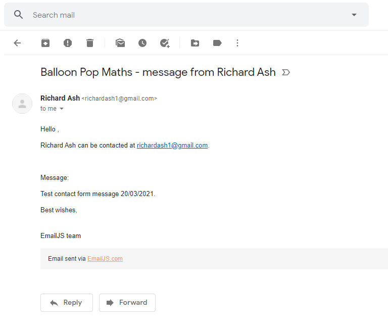

## Additional UX Testing ##
The game has been tested thoroughly by my 7 year old son and his classmates over a two week period, 
and no errors or bugs have been reported. Users have said that the game is fun to play, and parents 
have said that the game ties in well with the school curriculum and has helped with learning.

## Manual Testing ##
* **Balloon Pop Maths** title link has been tested and works correctly, linking to home page if selected:
 

* **Game Mode Selector** has been tested and works as intended, faciliting switching between
multiplication, division, subtraction and addition games. Hover styling is working as intended.  
 

* **High Score Panel**, has been tested and works as intended. **High Score Panel** is updated if the user gets a new high score.  
 

* **Play Button** has been tested and works as intended, launching the game. 
Hover styling is working as intended. 
 

* **Options Audio Controls** have been tested and work as intended, 
allowing audio to be toggled on and off from the **Options** area. 
Hover styling is working as intended. 

* **Options Button** has been tested and works as intended, opening collapsing **Options Panel**. 
Hover styling is working as intended.  
 

* **Options Panel** has been tested and works as intended. Options buttons are succesfully updated  
depending on selected game mode. Hover styling for each individual option button is working as intended.  

* **Multiplication and Division Options Panel** has been tested and works as intended. In multiplication and division modes, the first two options buttons ("2, 5, 10" and "Mixed 1 to 12")
act as intended (as toggle buttons) and de-select all other options buttons if selected. All other options buttons act as intended - 
multiple buttons may be selected and de-selected. If no other options buttons are active, options buttons cannot be de-selected.  
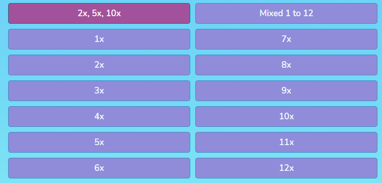

* **Addition and Subtraction Options Panel** has been tested and works as intended. In addition and subtraction modes, all four options buttons act as intended (as toggle buttons) and de-select all 
other options buttons if selected.  
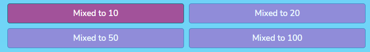 

* **How To Play Button** has been tested and works as intended, opening collapsing information panel.
Hover styling is working as intended.  
 

* **Footer Contact Developer Link** has been tested and works as intended, opening contact modal. 
Hover styling is working as intended.  
  
  

* **Footer GitHub Link** has been tested and works as intended, 
linking to developer page on github. 
Hover styling is working as intended.  
 

* **In Game Home Button** has been tested and works as intended, returning to Home panel from game.
Hover styling is working as intended.   

* **Game Loader**, has been tested and works as intended. 
**Game Loader** is displayed while the game window is loading.  
  

* **In Game Score** has been tested and works as intended, recording current score in-game:  

* **Answer Balloons** showing potential answers have been tested and work as intended. 
Balloons show a "pop" animation sequence and play a "pop" sound if the correct answer is selected. 
If an incorrect answer is selected, a "deflate" sound is played and the balloon and
answer fades out:

* **Custom Cursor** has been tested and works as intended. Cursor is changed to a drawing pin when hovering over answer balloons:  

* **In Game Audio Controls** have been tested and work as intended, allowing audio to be toggled on and off in-game:  

* **Health Bar** has been tested and works as intended. Game finishes when health is fully depleted. 
If game is played on "Easy" difficulty level (selected in options), health is set to 5 hearts.
If game is played on "Medium" difficulty level (selected in options), health is set to 3 hearts.
If game is played on "Hard" difficulty level (selected in options), health is set to 1 heart:

* **Question Panel** has been tested and works as intended, showing the current question:

* **Contact Modal** has been tested and works as intended. 
If the contact form is succesfully submitted, a "Success" modal is displayed and an email is
sent to the developer. 

* **Game Feedback Modal** has been tested and works as intended,  giving varying feedback to the user at the end of a game:

### Responsive Design ###
* Responsive design has been tested by using [Chrome DevTools](https://developers.google.com/web/tools/chrome-devtools) 
to emulate viewing the website on a number of devices with varying screen dimensions, 
including iPhone 5/SE, iPhone 6/7/8, iPhone 6/7/8 plus, iPhone 11, iPad, iPad Pro, Moto G4, Galaxy S5, Surface Duo, 
Galaxy Fold, Widescreen Laptop and Desktop PC. 
See [Responsive Design Testing](./assets/testing/responsive) screen prints, a selection of which are shown below:  

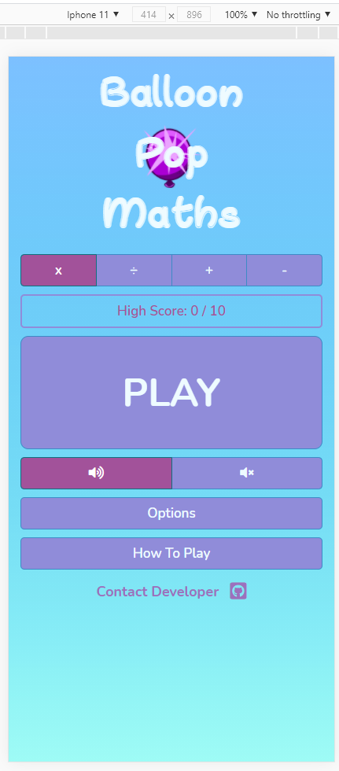  
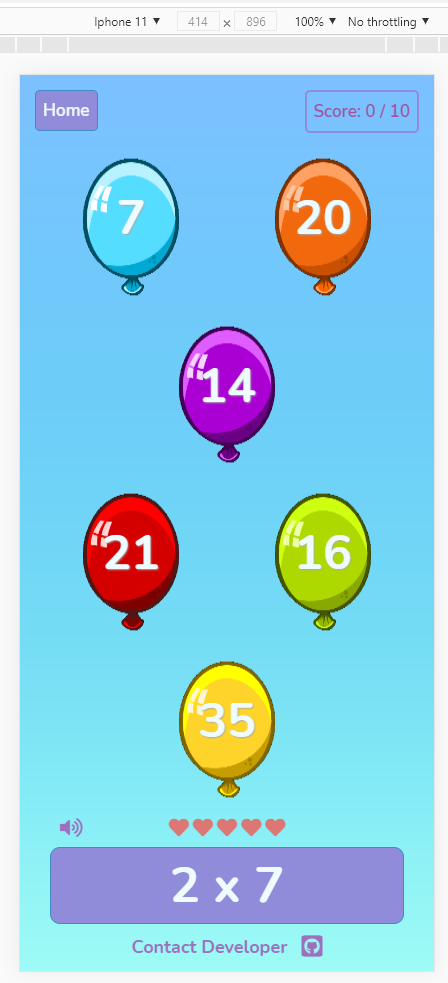  

  
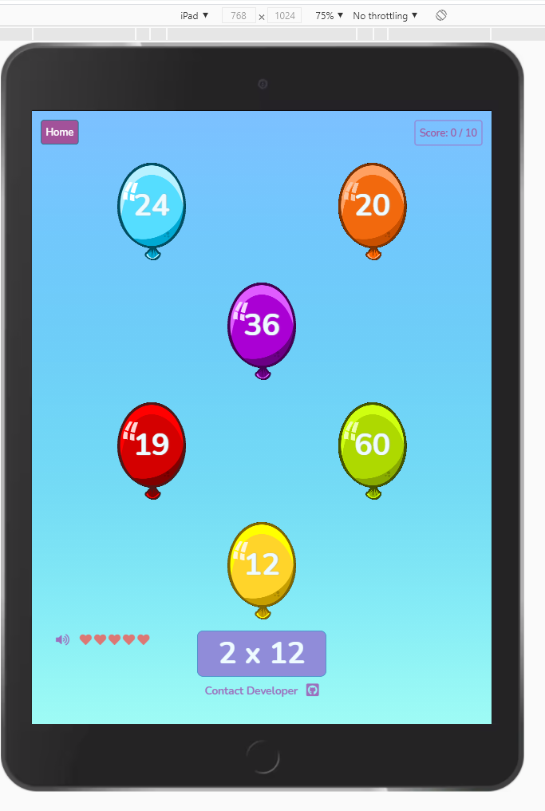  

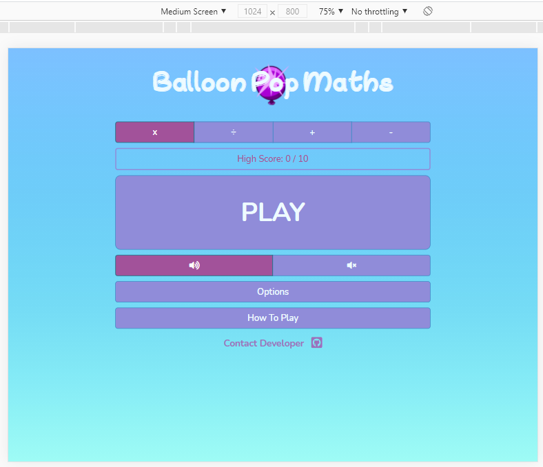  
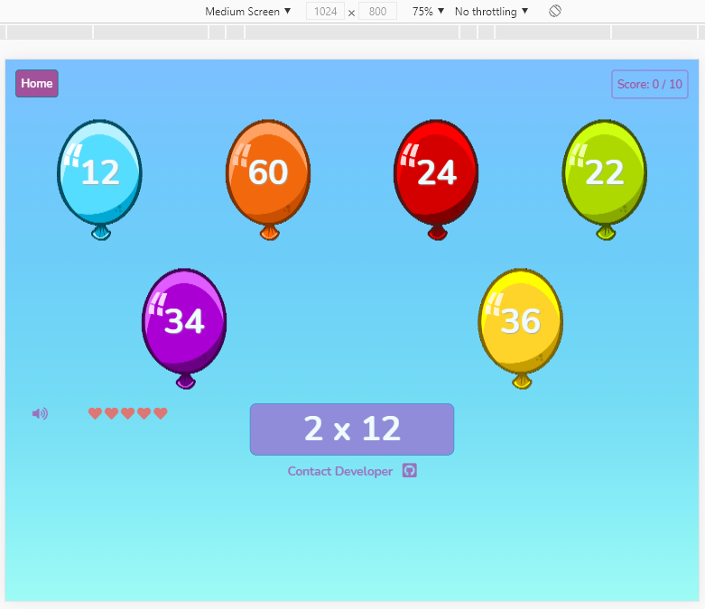  

* Responsive design was then further tested using the 
[Responsive Viewer](https://chrome.google.com/webstore/detail/responsive-viewer/inmopeiepgfljkpkidclfgbgbmfcennb?hl=en)
plug in for chrome. This emulates viewing the website on a large number of devices, 
including iPhone XR, iPhone XS Max, iPhone XS, iPhone X, Galaxy S9 Plus, Galaxy S8 Plus, Galaxy S9, Note 8, Note S8, Pixel 3, Pixel 3XL,
Medium Desktop PC and Large Desktop PC. See 
[Responsive Design Testing](./assets/testing/responsive) screen prints, also shown below: 
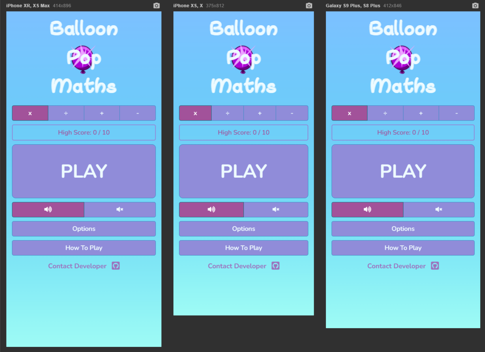  
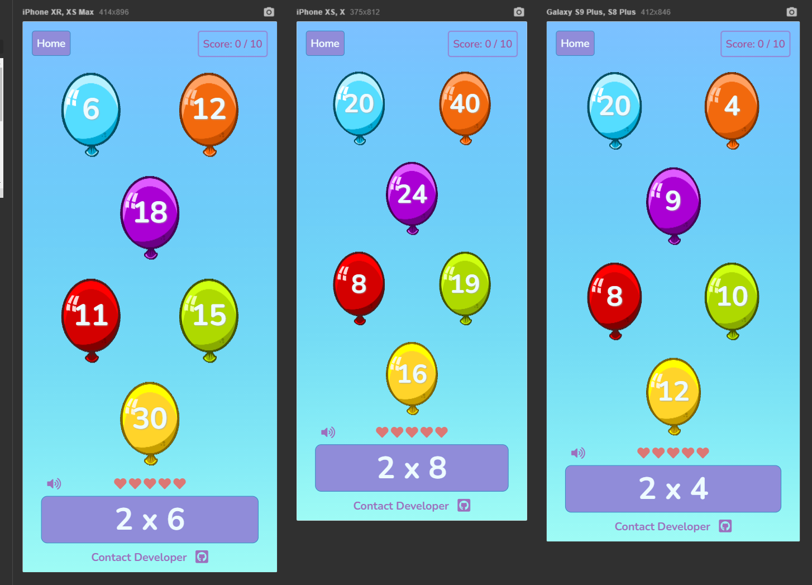  

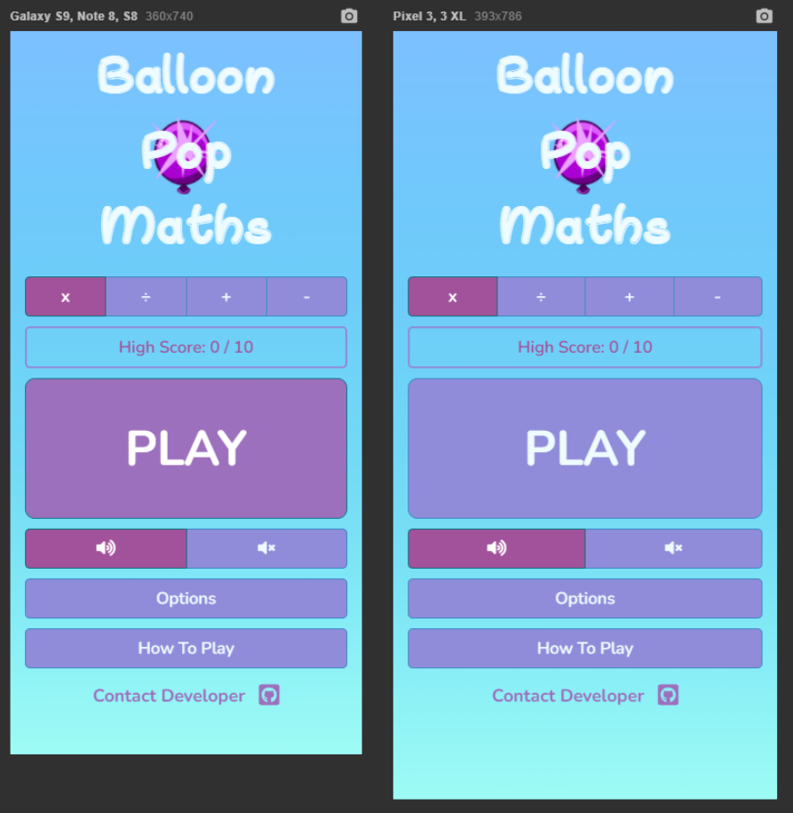  
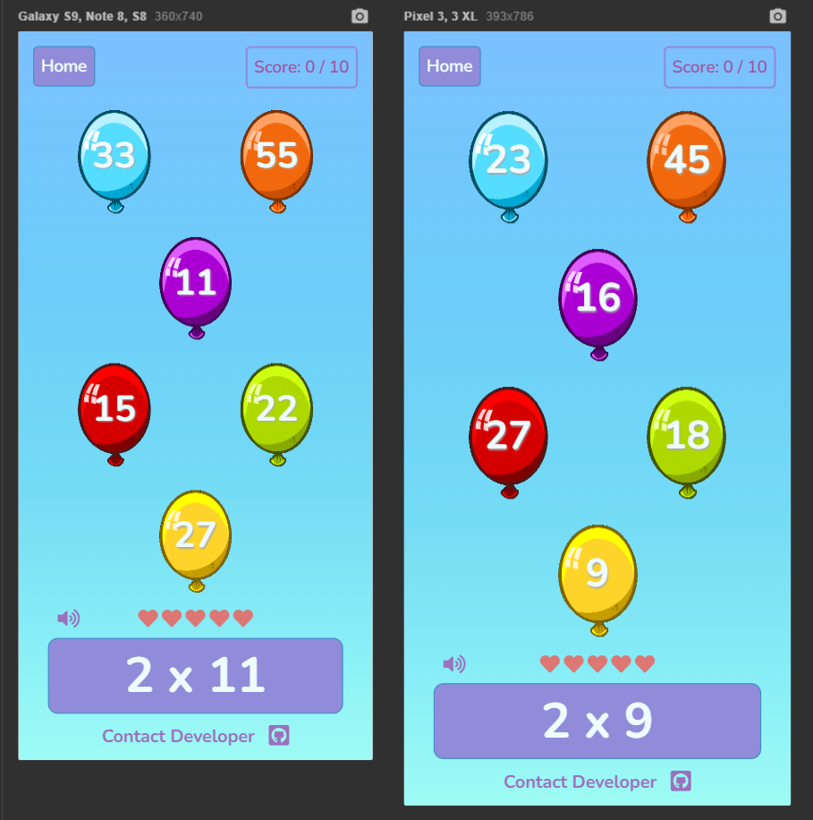 

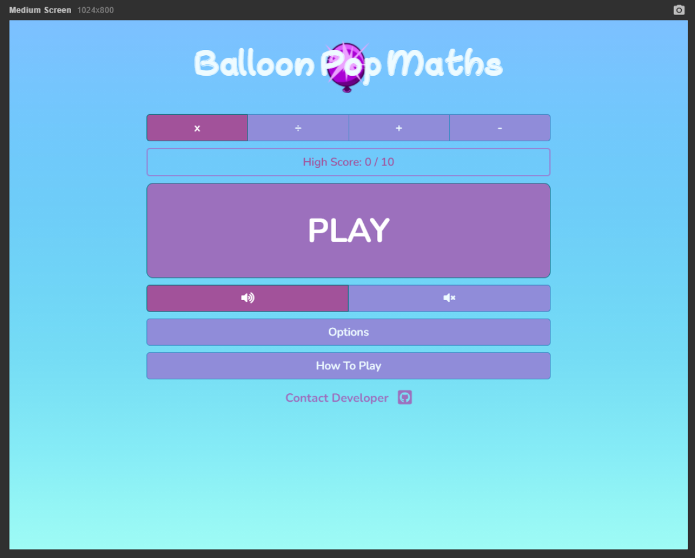   
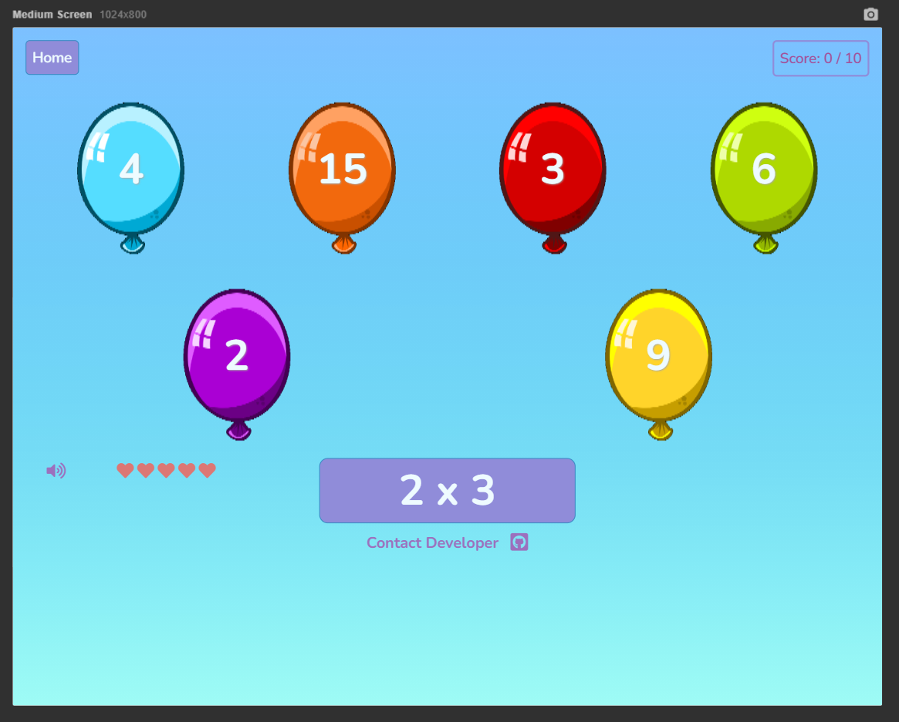  

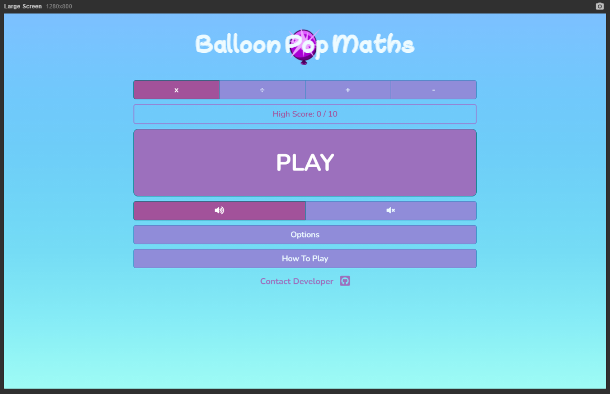  
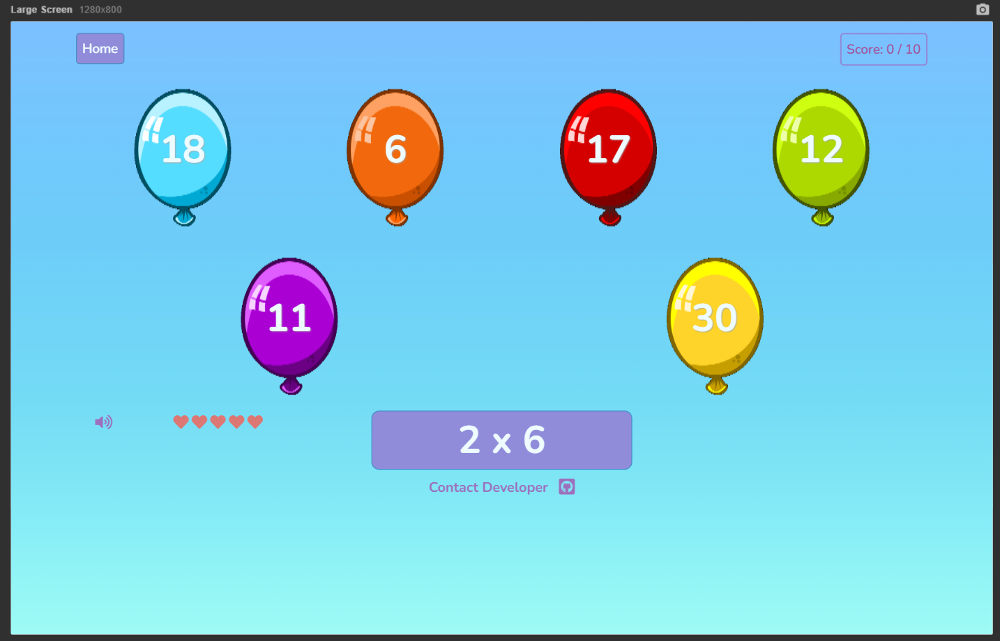   

* Responsive design has been tested with [Google Chrome](https://www.google.com/intl/en_uk/chrome/) font size set to **Medium** and **Large** in **Chrome Settings** > **Appearence**.

* The **Balloon Pop Maths** title behaves as expected, stacking as intended on screens under 768 pixels wide.
* The **Balloon Pop Maths** title dynamically re-sizes and re-positions as intended on screen sizes under 680 pixels high.
* The **Game** view behaves as expected, showing 2 panels of 3 balloons stacked vertically on small and medium 
devices under 992 pixels wide, and shown side by side on large devices over 992 pixels wide.
* The **Game** view dynamically sizes as expected on devices up to 992px pixels wide. A fixed size is 
implemented on large devices over 992 pixels wide and behaves as expected. 

### Browser Compatibility Testing ###
The website was tested on the following browsers and operating systems, 
using a combination of manual testing across various devices and the [Browserstack](https://www.browserstack.com/) emulator:
* [Google Chrome](https://www.google.com/intl/en_uk/chrome/) ([Windows 10](https://www.microsoft.com/en-us/windows), [Android 11](https://www.android.com/android-11/) and [Mac OS Big Sur](https://www.apple.com/uk/macos/big-sur/)).
* [Microsoft Edge](https://www.microsoft.com/en-us/edge) ([Windows 10](https://www.microsoft.com/en-us/windows) and [Mac OS Big Sur](https://www.apple.com/uk/macos/big-sur/)).
* [Microsoft Internet Explorer 11](https://support.microsoft.com/en-us/topic/internet-explorer-downloads-d49e1f0d-571c-9a7b-d97e-be248806ca70#ID0EBBD=Windows_10) ([Windows 10](https://www.microsoft.com/en-us/windows)).
* [Safari](https://www.apple.com/uk/safari/) ([Mac OS Big Sur](https://www.apple.com/uk/macos/big-sur/) and [iOS](https://www.apple.com/uk/ios/ios-14/)).
* [Firefox](https://www.mozilla.org/en-GB/firefox/new/) ([Windows 10](https://www.microsoft.com/en-us/windows) and [Mac OS Big Sur](https://www.apple.com/uk/macos/big-sur/)).
* [Opera](https://www.opera.com/) ([Windows 10](https://www.microsoft.com/en-us/windows) and [Mac OS Big Sur](https://www.apple.com/uk/macos/big-sur/)).  

The following issue was uncovered during browser compatibility testing: 
* [CSS custom properties (variables)](https://developer.mozilla.org/en-US/docs/Web/CSS/Using_CSS_custom_properties) are not supported by [Microsoft Internet Explorer](https://support.microsoft.com/en-us/topic/internet-explorer-downloads-d49e1f0d-571c-9a7b-d97e-be248806ca70#ID0EBBD=Windows_10).
See [Can I Use link](https://caniuse.com/css-variables). This is not envisaged to be a major problem, as usage of [Microsoft Internet Explorer](https://support.microsoft.com/en-us/topic/internet-explorer-downloads-d49e1f0d-571c-9a7b-d97e-be248806ca70#ID0EBBD=Windows_10)
is now very low. A statement has been added into the **Browser Support** section in the [README.md](README.md) to make it clear that **Balloon Pop Maths** 
does not support [Microsoft Internet Explorer](https://support.microsoft.com/en-us/topic/internet-explorer-downloads-d49e1f0d-571c-9a7b-d97e-be248806ca70#ID0EBBD=Windows_10).

### Javascript Code Library Testing ###
Each individual function and event handler contained in the [JavaScript Code Library](./assets/js) was thoroughly 
tested and de-bugged in the Console window during the **Phase 1 Development**, to confirm correct operation. 
See [Bugs Fixed During Testing](#bugs-fixed-during-testing) for additional JavaScript bugs fixed during the testing process.

## Bugs Fixed During Testing ##
* See [Custom CSS Styling](#custom-css-styling), [HTML](#html) and [JavaScript Code Library](#javascript-code-library) sections 
for bugs fixed during the automated testing process. 
* It was noted in feedback during initial user testing that the **Game** section was not fully scaling to fill the entire vertical 
screen area available, resulting in users of very small devices (e.g. iPhone 5) having to scroll up and down during the game 
to see all of the **Game** elements. This was rectified by adding three 
[CSS custom properties (variables)](https://developer.mozilla.org/en-US/docs/Web/CSS/Using_CSS_custom_properties) at the top of the 
[Custom CSS](/assets/css/style.css): **--canvassize**, **--balloontextsize** and **--balloontextlineheight**. The available area and 
corresponding maximum size for the **Balloon** canvas element, and the corresponding maximum **Balloon** text size and 
line height are now calculated to ensure that the balloons are as large as is possible to fit the vertical screen 
space available on smaller devices. **Balloon** canvas size and text height is fixed on devices over 992 pixels wide. 
See below screen prints: 

  
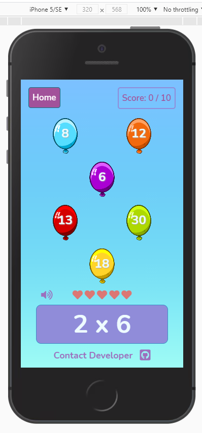  

* It was noted during manual testing that the answer **Balloons** and text were fading out when 
the wrong answer was selected as expected, but the fade out was persisting and the **Balloons** and text were 
not showing when a new game was started. This bug was fixed by showing all answer text and **Balloon** elements 
in the **playGame** function, contained in the [JavaScript Game Logic Function Library](./assets/js/game-logic.js)
using the [jQuery show](https://api.jquery.com/show/) method.

* It was noted during manual testing that when selecting specific times table or division table options buttons from the 
options panel, it was possible to de-select all options buttons. An additional class, **btn-mul-div-sticky** was added to 
the relevant specific times table and division table options buttons, an additional function **checkOtherStickyButtons** was 
added to the [JavaScript Display Interaction Function Library](./assets/js/display.js), and the options button on-click event 
handler in the [JavaScript Event Handler Library](./assets/js/events.js) was updated. The **checkOtherStickyButtons** 
function checks to see if other options buttons are active. If there are no other options buttons active, 
the selected options button is toggled back on, meaning the button cannot be de-selected.

* It was noted during manual testing that when specific question groups are selected e.g. 2x tables only, 
the questions presented are not always unique. This is becuase a random question between 1 and 12 is generated, 
and there is therefore a chance of the same question being generated twice. This issue was rectified by adding the 
function **checkQuestionArray** to the [JavaScript Maths Function Library](./assets/js/maths.js). 
This function enables the question array to be checked prior to a new random question being added. 
The logic of the **returnMultiplicationQuestionArray**, **returnDivisionQuestionArray**, 
**returnAdditionQuestionArray** and **returnSubtractionQuestionArray** functions was updated to include 
checking using the **checkQuestionArray** function. Note that it is still possible for duplicate questions 
to be generated if the number of questions is set to 20 and only one specific multiplication or division 
option button has been selected, as there are only 12 possible questions for each specific times table.

* A [404 error page](404.html) was added during manual testing to redirect the user back to the [index page](index.html) 
should they try to access a non-existent page on the **Balloon Pop Maths** site.

## Bugs Remaining ##
There are no known bugs remaining.